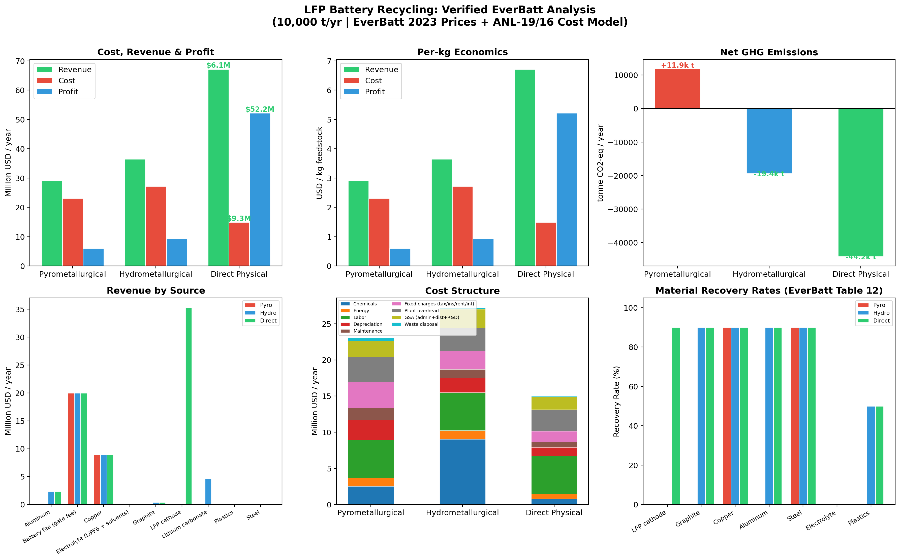

# EverBatt LFP Battery Recycling Analysis

[](https://www.python.org/downloads/)
[](LICENSE)
[](https://github.com/lingrany/EverBatt-LFP-Recycling-Analysis/actions)

[**中文文档 → 新手完全指南.md**](新手完全指南.md)

Python implementation of **Techno-Economic Analysis (TEA)** and **Life Cycle Assessment (LCA)** for LFP (LiFePO₄) battery recycling, based on Argonne National Lab's [EverBatt model](https://publications.anl.gov/anlpubs/2019/07/153050.pdf) (ANL-19/16).

Compare three recycling methods — **Pyrometallurgical**, **Hydrometallurgical**, and **Direct Recycling** — on cost, revenue, profit, and GHG emissions.

## Visual Overview



*6-panel comparison: (top row) cost/revenue/profit bars, per-kg economics, net GHG emissions; (bottom row) revenue by material source, cost structure breakdown, material recovery rates.*

## Quick Start

```bash
pip install -r requirements.txt
python lfp_analysis_verified.py
```

Output: terminal tables + `LFP_Recycling_Verified.png`.

## CLI Usage

```bash
# Default run (10,000 tonnes/yr, 2019 prices)
python lfp_analysis_verified.py

# 5,000 t/yr + 2023 prices
python lfp_analysis_verified.py -t 5000 -p 2023

# Custom electricity price, no plot
python lfp_analysis_verified.py --electricity-price 0.15 --no-plot

# Full options
python lfp_analysis_verified.py --help
```

| Flag | Description | Default |
|------|-------------|---------|
| `-t, --throughput` | Plant scale (tonnes/yr) | 10000 |
| `-p, --prices` | Price year: `2019` or `2023` | 2019 |
| `-f, --battery-fee` | Gate fee ($/kg) | -2.0 (2019) |
| `--electricity-price` | $/kWh | 0.07 |
| `--gas-price` | $/MMBTU | 4.50 |
| `-o, --output` | Chart output path | LFP_Recycling_Verified.png |
| `--no-plot` | Skip chart, print tables only | - |

## Results (10,000 tonnes/year LFP batteries)

| Method | Cost ($/kg) | Revenue ($/kg) | Profit ($/kg) | Net GHG |
|--------|:-----------:|:--------------:|:-------------:|:-------:|
| Pyrometallurgical | ~2.3 | ~2.9 | **+0.6** | Highest |
| Hydrometallurgical | ~2.7 | ~3.7 | **+0.9** | Medium |
| Direct Recycling | ~1.5 | ~6.7 | **+5.2** | Lowest (negative) |

**Conclusion: Direct recycling > Hydrometallurgical > Pyrometallurgical** for LFP — consistent with Xu et al. (Joule 2020) and Ji et al. (Nat. Commun. 2024).

*Note: Results shown with 2019 prices and -$2/kg gate fee. Profit values shift significantly with lithium prices and gate fees — use `-p 2023` for updated prices.*

## Files

| File | Description |
|------|-------------|
| `lfp_analysis_verified.py` | **Main analysis** — verified against EverBatt documentation |
| `lfp_analysis.py` | Initial version (simpler cost model) |
| `read_everbatt.py` | Tool to fix XML issues and read the EverBatt Excel model |
| `新手完全指南.md` | **中文入门指南** — 从零讲解每个概念 |
| `requirements.txt` | Python dependencies |
| `CLAUDE.md` | Guidance for Claude Code |

## Data Sources

- **EverBatt 2019 Documentation** (ANL-19/16) — Argonne National Laboratory
- Material prices and cost model from EverBatt Tables 10–15
- Benchmarked against Xu et al. (Joule, 2020) and Ji et al. (Nat. Commun., 2024)

## License

MIT — see [LICENSE](LICENSE) file.
